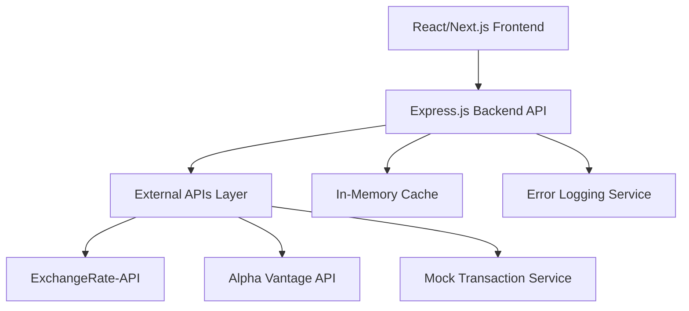

# Design Document

## Overview

The Personal Finance Dashboard is a full-stack TypeScript application built with a React/Next.js frontend and Node.js/Express backend. The system follows a microservices-inspired architecture where the backend aggregates data from multiple external APIs and serves it to the frontend through a unified REST API. The application emphasizes real-time data updates, responsive design, and robust error handling to provide a professional client-ready experience.

## Architecture

### High-Level Architecture



### Technology Stack

**Frontend:**
- Next.js 14 with TypeScript
- Tailwind CSS for styling
- Chart.js/Recharts for data visualization
- Axios for API communication
- React Query for data fetching and caching

**Backend:**
- Node.js with Express.js and TypeScript
- Node-cache for in-memory caching
- Axios for external API calls
- Winston for logging
- Cors for cross-origin requests

**External APIs:**
- ExchangeRate-API (free tier: 1,500 requests/month)
- Alpha Vantage API (free tier: 5 API requests per minute, 500 per day)
- JSONPlaceholder for mock transaction data

## Components and Interfaces

### Frontend Components

**Dashboard Layout:**
```typescript
interface DashboardProps {
  user: User;
  financialSummary: FinancialSummary;
}

interface FinancialSummary {
  totalBalance: number;
  portfolioValue: number;
  monthlyChange: number;
  currency: string;
}
```

**Currency Exchange Component:**
```typescript
interface ExchangeRatesProps {
  baseCurrency: string;
  rates: ExchangeRate[];
  lastUpdated: Date;
  onCurrencyChange: (currency: string) => void;
}

interface ExchangeRate {
  currency: string;
  rate: number;
  change24h: number;
}
```

**Portfolio Tracker Component:**
```typescript
interface PortfolioProps {
  stocks: Stock[];
  onAddStock: (symbol: string) => void;
  onRemoveStock: (symbol: string) => void;
}

interface Stock {
  symbol: string;
  name: string;
  currentPrice: number;
  change: number;
  changePercent: number;
  lastUpdated: Date;
}
```

**Transaction List Component:**
```typescript
interface TransactionListProps {
  transactions: Transaction[];
  filters: TransactionFilters;
  onFilterChange: (filters: TransactionFilters) => void;
}

interface Transaction {
  id: string;
  date: Date;
  amount: number;
  description: string;
  category: TransactionCategory;
  type: 'income' | 'expense' | 'transfer';
}
```

### Backend API Interfaces

**API Routes:**
```typescript
// GET /api/dashboard - Main dashboard data
interface DashboardResponse {
  summary: FinancialSummary;
  recentTransactions: Transaction[];
  portfolioSummary: PortfolioSummary;
}

// GET /api/exchange-rates?base=USD
interface ExchangeRatesResponse {
  baseCurrency: string;
  rates: ExchangeRate[];
  lastUpdated: Date;
}

// GET /api/portfolio
interface PortfolioResponse {
  stocks: Stock[];
  totalValue: number;
  totalChange: number;
}

// GET /api/transactions?category=&dateFrom=&dateTo=
interface TransactionsResponse {
  transactions: Transaction[];
  totalCount: number;
  summary: TransactionSummary;
}
```

**Service Layer:**
```typescript
interface ExternalAPIService {
  getExchangeRates(baseCurrency: string): Promise<ExchangeRate[]>;
  getStockPrice(symbol: string): Promise<Stock>;
  getTransactions(filters: TransactionFilters): Promise<Transaction[]>;
}

interface CacheService {
  get<T>(key: string): T | null;
  set<T>(key: string, value: T, ttl: number): void;
  invalidate(pattern: string): void;
}
```

## Data Models

### Core Data Models

```typescript
interface User {
  id: string;
  name: string;
  email: string;
  preferredCurrency: string;
  portfolioSymbols: string[];
}

interface FinancialSummary {
  totalBalance: number;
  portfolioValue: number;
  monthlyIncome: number;
  monthlyExpenses: number;
  currency: string;
  lastUpdated: Date;
}

interface ExchangeRate {
  currency: string;
  rate: number;
  change24h: number;
  lastUpdated: Date;
}

interface Stock {
  symbol: string;
  name: string;
  currentPrice: number;
  previousClose: number;
  change: number;
  changePercent: number;
  volume: number;
  lastUpdated: Date;
}

interface Transaction {
  id: string;
  userId: string;
  date: Date;
  amount: number;
  description: string;
  category: TransactionCategory;
  type: 'income' | 'expense' | 'transfer';
  currency: string;
}

enum TransactionCategory {
  FOOD = 'food',
  TRANSPORT = 'transport',
  ENTERTAINMENT = 'entertainment',
  UTILITIES = 'utilities',
  SALARY = 'salary',
  INVESTMENT = 'investment',
  OTHER = 'other'
}
```

### API Response Models

```typescript
interface APIResponse<T> {
  success: boolean;
  data?: T;
  error?: {
    code: string;
    message: string;
    details?: any;
  };
  timestamp: Date;
}

interface PaginatedResponse<T> extends APIResponse<T[]> {
  pagination: {
    page: number;
    limit: number;
    total: number;
    hasNext: boolean;
  };
}
```

## Error Handling

### Frontend Error Handling

**Error Boundary Component:**
- Catches React component errors
- Displays user-friendly error messages
- Provides retry mechanisms
- Logs errors for debugging

**API Error Handling:**
- Axios interceptors for global error handling
- Retry logic for failed requests
- Fallback to cached data when available
- User notifications for critical errors

**Loading States:**
- Skeleton loaders for data fetching
- Progress indicators for long operations
- Timeout handling for slow requests

### Backend Error Handling

**Global Error Middleware:**
```typescript
interface ErrorResponse {
  success: false;
  error: {
    code: string;
    message: string;
    details?: any;
  };
  timestamp: Date;
}

// Error codes
enum ErrorCodes {
  EXTERNAL_API_FAILURE = 'EXTERNAL_API_FAILURE',
  RATE_LIMIT_EXCEEDED = 'RATE_LIMIT_EXCEEDED',
  INVALID_CURRENCY = 'INVALID_CURRENCY',
  INVALID_STOCK_SYMBOL = 'INVALID_STOCK_SYMBOL',
  CACHE_MISS = 'CACHE_MISS'
}
```

**External API Error Handling:**
- Circuit breaker pattern for failing APIs
- Exponential backoff for retries
- Fallback to cached data
- Graceful degradation of features

**Rate Limiting:**
- Per-endpoint rate limiting
- User-based rate limiting
- API key rotation for external services

## Testing Strategy

### Frontend Testing

**Unit Tests:**
- Component rendering tests with React Testing Library
- Hook testing for custom React hooks
- Utility function tests
- API service mocking

**Integration Tests:**
- Component interaction tests
- API integration tests with mock server
- User flow testing
- Responsive design testing

**E2E Tests:**
- Critical user journeys
- Cross-browser compatibility
- Performance testing

### Backend Testing

**Unit Tests:**
- Service layer testing
- API endpoint testing
- Data transformation testing
- Error handling testing

**Integration Tests:**
- External API integration tests
- Database integration tests (if added later)
- Cache integration tests
- End-to-end API flow tests

**Load Testing:**
- API performance under load
- Rate limiting validation
- Cache performance testing
- External API failure simulation

### Test Data Strategy

**Mock Data:**
- Realistic financial data for development
- Edge case scenarios for testing
- Performance testing datasets
- Error condition simulations

**External API Mocking:**
- Mock responses for all external APIs
- Failure scenario simulation
- Rate limiting simulation
- Network delay simulation

## Performance Considerations

### Frontend Optimization

- Code splitting with Next.js dynamic imports
- Image optimization with Next.js Image component
- React Query for efficient data caching
- Lazy loading for non-critical components
- Bundle size optimization

### Backend Optimization

- In-memory caching for external API responses
- Request deduplication for concurrent requests
- Compression middleware for API responses
- Connection pooling for external API calls
- Background data refresh for cache warming

### Caching Strategy

**Frontend Caching:**
- React Query cache with stale-while-revalidate
- Browser localStorage for user preferences
- Service worker for offline functionality (future enhancement)

**Backend Caching:**
- Exchange rates: 1-hour TTL
- Stock prices: 5-minute TTL during market hours, 1-hour after close
- Transaction data: 15-minute TTL
- Portfolio summaries: 10-minute TTL

## Security Considerations

### API Security

- CORS configuration for frontend domain
- Rate limiting to prevent abuse
- Input validation and sanitization
- API key management for external services
- Request logging for audit trails

### Data Protection

- No sensitive financial data storage
- API key encryption in environment variables
- Secure HTTP headers
- Input validation on all endpoints

### Frontend Security

- XSS protection through React's built-in escaping
- Content Security Policy headers
- Secure cookie handling
- Environment variable protection